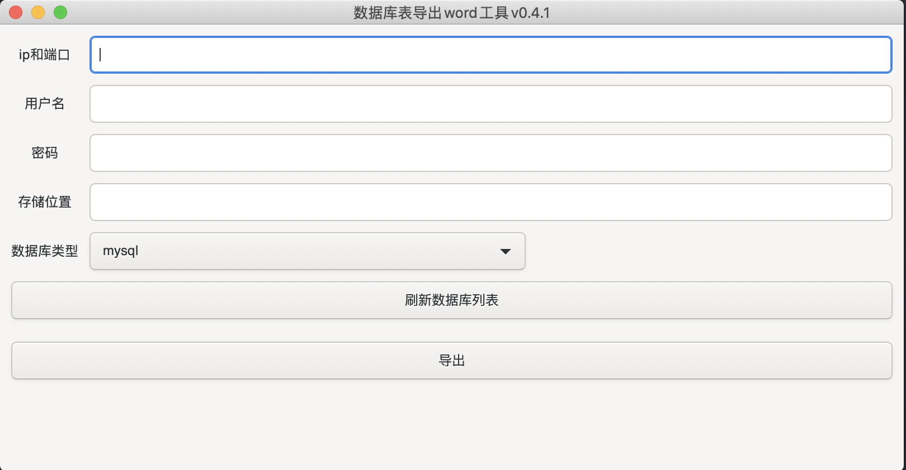

# dbTool

## 程序主界面

## 数据项说明

* ipPort

> 数据库的ip和端口，形式：ip:port。例如：192.168.123.74:3306

* username

> 数据库的登录用户名

* password

> 数据库的登录密码

* 数据库名称

> 要导出表结构的数据库名称，多个数据库用"，"分隔。不能出现不必要的空格，否则会认为空格也是数据库名称的一部分

* 存储位置

> 导出的word文档存放的位置
